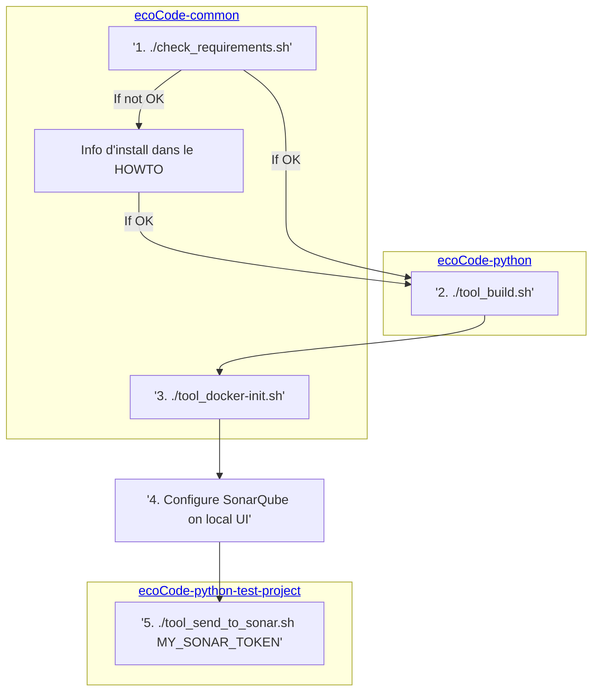

# Common doc / tools

This repository contains common parts like :

- documentation : please read MarkDown files (`*.md`) in `doc` directory
- tools : if needed, please read `README.md` files on each tool of `tool` directory

